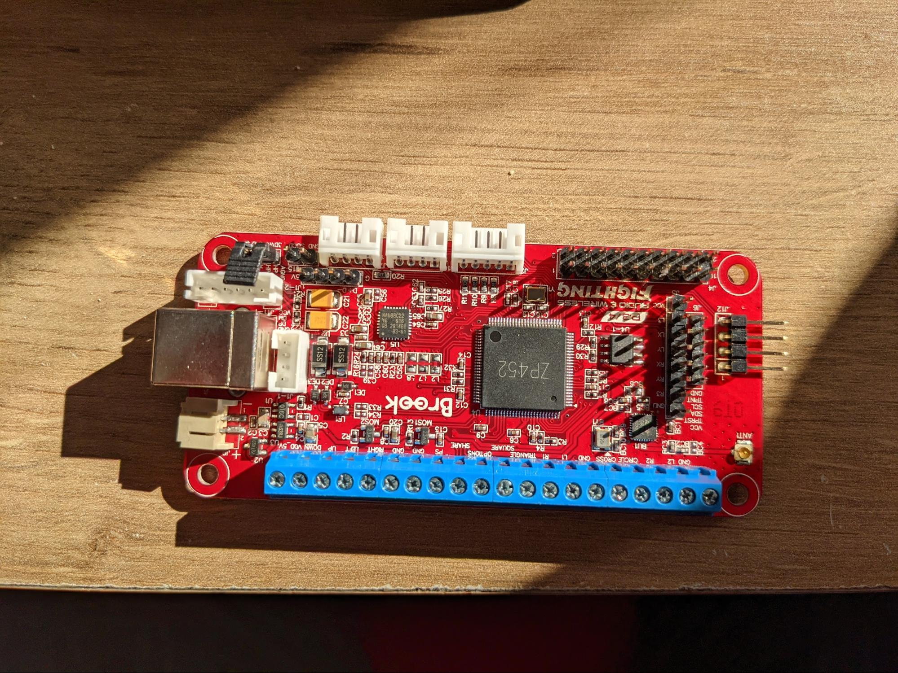
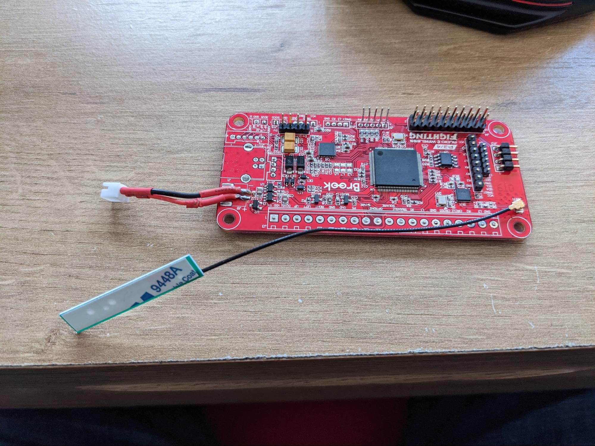
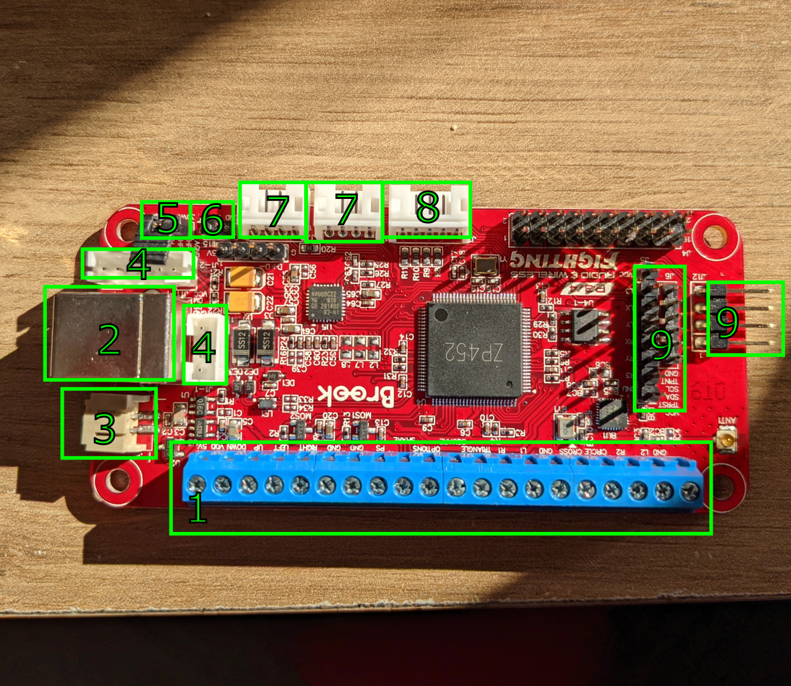
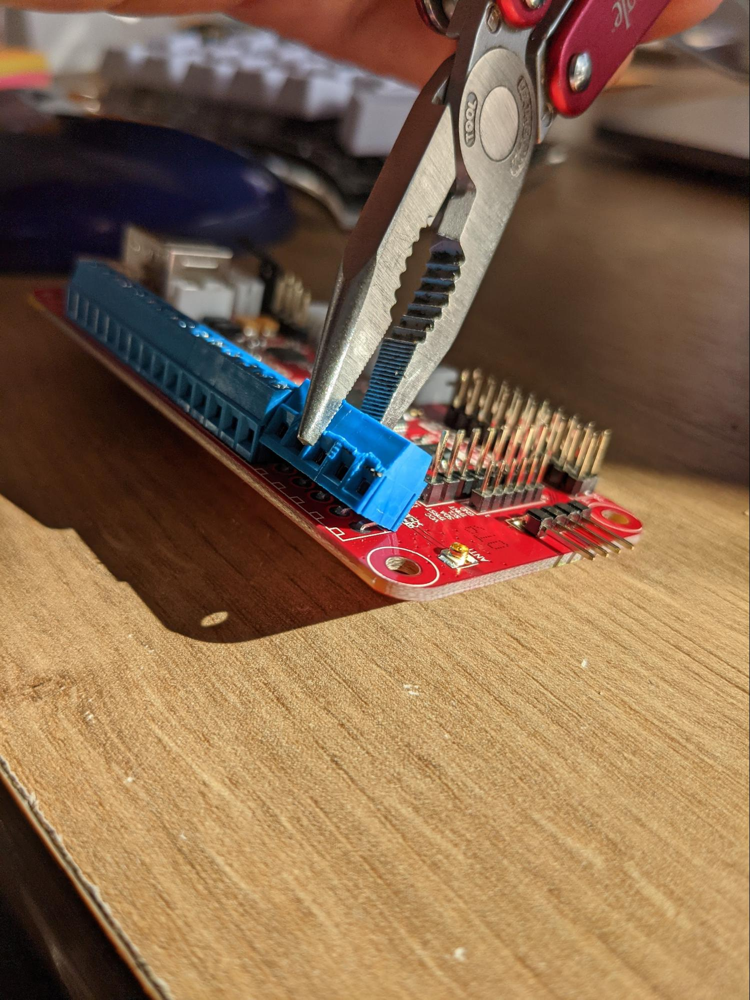
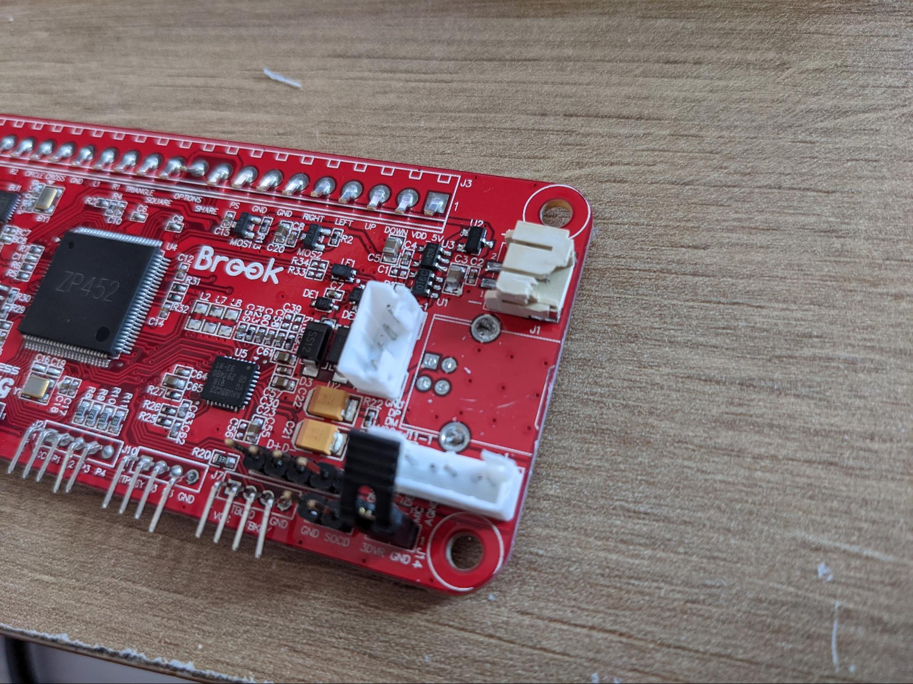
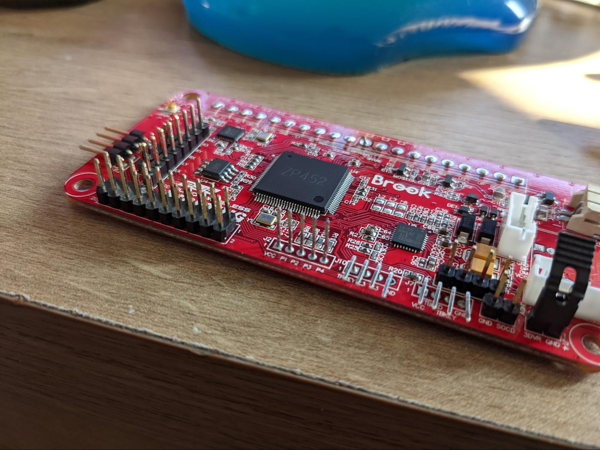
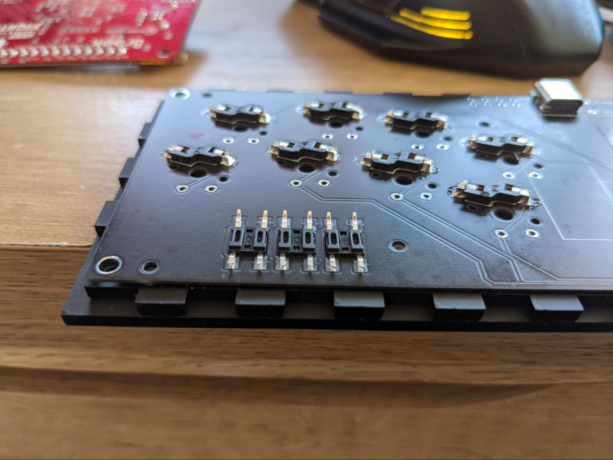

# Brooks board prepaeation

Let's prepare the Brooks Board. We have to get from here:

To this:

Items to be modified:

1.This needs to be removed by grabbing in pliers and rocking them back and forth. Remaining pins need to be trimmed with a cutter

2. This is the difficult one. You need to cut this into small pieces with a cutter. Be wary that this may dull your cutter if it’s too small. USB is anchored into pcb on its sides and by 4 USB pins. When you remove the side anchors, it comes off easily by rocking it back and forth.

3. Cut it away. Replace it by attached female plug on wire, or raw wires (they are single solid core, they easily go into battery JST plug).
4. Remove - cut the pins with housing. Be careful to not damage the pcb.
5. Cut down to the plastic part of the pin, solder together on the back side
6.  Cut down to the plastic part of the pin. You have to select which SCOD cleaning option you want, and either solder together on the back side, or leave alone. Personally, I use SOCD Mode 2 (left + right = nothing).
7. Remove pins and housing
8. Remove JUST the housing. Wobble it from left to right by tugging it with pliers. Then, bend them straight up.

9. Cut it down to the plastic.

# Soldering tips
* USB and resistors goes UNDER the board. The silkscreen markings for resistors are printed on the WRONG side, sorry about this.
* Top surface needs to be as flat as possible. If any solder is sticking out too much, rework to make it flat.
* Solder the brooks board as the LAST step. Be sure to connect antenna and battery connectors on the brooks, as it’s super difficult to do it afterwards.
* Solder the USBC first. Use multimeter to be sure that there are no bridges (some pins are connected on the board, consult kicad files).
* The USBC port pins may need down to the pcb board thickness - be very delicate when inserting it, to not bend any legs. Apply a ton of flux and drag-solder it with k-tip.
* Led + (longer legs) go to holes on the edge of the board. 
*Solder the leds with an acrylic board screwed to the board, to make sure they sit right.place acrylic on the table, to make sure leds are flush and not interfering with the outer acrylic plate.
* Bend legs on option switches, straighten them with pliers and solder them this with both top acrylic plates, to make sure they are well placed:

# Soldering brooks board to smolbox board

* When joining Smolbox board with brooks board, connect antenna and power connector to brooks board, join them as close as possible. Verify their height against the wall panel. Cut pins flush FIRST and solder them, trying to make joins flat. Start with usb pins, so you could connect it to pc and verify that it works, in the worst case you will have to unsolder just 4 pins.
* When everything is in order, you can increase the strength of the case by glueing joins on top and side panels (but not the bottom one) inside with Tensol Acrylic glue - it melts acrylic together. But it can get very messy, screws are just fine.
* Cover the brook board with electrical tape to prevent shorting pins against the metal plate.

